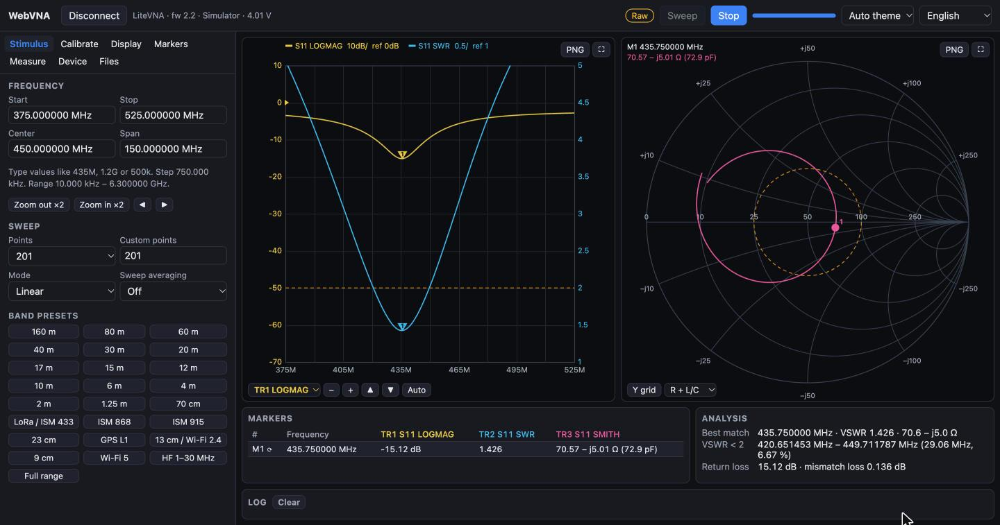

# WebVNA

A browser app for the **LiteVNA** (and the NanoVNA V2 family; NanoVNA V1/-H/-H4 support is experimental). Connect over USB, sweep from 50 kHz to 6.3 GHz, calibrate, and analyse S11/S21 on rectangular and Smith charts. It runs in Chrome or Edge with no install and no drivers.

**Try it now: [vkopitsa.github.io/WebVNA](https://vkopitsa.github.io/WebVNA/)** (click **Simulator** if you have no device).

[](https://github.com/vkopitsa/WebVNA/actions/workflows/deploy.yml)



*The built-in simulator, sweeping an antenna near 435 MHz.*

## Why

NanoVNA-App and NanoVNA-Saver are desktop programs. WebVNA does the same job in a browser tab through the [Web Serial API](https://developer.mozilla.org/docs/Web/API/Web_Serial_API). There is nothing to install, it works the same on macOS, Windows, Linux and ChromeOS, and you can host it as a static site. The main use is antenna work: S11, VSWR, impedance and bandwidth, with S21 and time-domain analysis on top.

## Features

- **Device:** Web Serial or WebUSB, auto-reconnect, IF averaging, output power, channel select, device calibration mode, battery voltage, clock, device screenshot, hex comms monitor.
- **Sweeps:** start/stop/center/span, up to 65,535 points (segmented), log and CW sweeps, sweep averaging, amateur and ISM band presets.
- **Calibration:** SOL, isolation, thru and enhanced response, cal-kit models, save/recall/import/export, interpolation when the range changes, electrical delay and port extension.
- **Display:** 4 traces in 27 formats (log mag, phase, group delay, SWR, R/X, \|Z\|, Q, L/C, G/B, …), Smith and polar charts, stored traces A–D with data/memory maths, `.sNp` overlays, light and dark themes, a mobile layout.
- **Markers:** 8 markers, peak/valley search and tracking, delta markers, marker → start/stop/center/span/e-delay.
- **Analysis:** VSWR bandwidth and best match, L/C matching networks, filter (type, insertion loss, bandwidth, Q), cable, crystal and LC resonators, resonances.
- **Time domain:** TDR/DTF with low-pass impulse/step and band-pass modes, Kaiser windows, velocity factor, distance or time axis.
- **Files:** Touchstone `.s1p`/`.s2p` (RI/MA/DB) and CSV export/import, auto-save to a folder, chart PNG.
- **Devices:** LiteVNA / NanoVNA V2 (binary protocol) and, experimentally, NanoVNA V1 / -H / -H4 (text shell; NanoVNA-D firmware is best, stock firmware sweeps 101 points). The protocol is detected on connect, and controls the device lacks (screenshot, battery, IF averaging, power, channels, device calibration) are hidden. A Bluetooth serial module can be used where the browser supports Web Serial over Bluetooth (Chrome on Android, experimental).
- **Simulator:** byte-level emulators of the LiteVNA and of the NanoVNA-H / -H4 shell (NanoVNA-D and stock firmware) with antenna, filter, crystal, cable, RLC and calibration-standard DUTs. Try everything without hardware.
- **Scripting:** a `window.webvna` API and an in-app Script tab (see [Scripting API](#scripting-api)).
- **Languages:** English and Ukrainian.

## Quick start

You need [Node.js](https://nodejs.org/) 20.19+ or 22.12+ and Chrome or Edge 89+ (Firefox and Safari don't support Web Serial).

```bash
git clone https://github.com/vkopitsa/WebVNA.git
cd WebVNA
npm install
npm run dev       # http://localhost:5173
```

1. Close NanoVNA-App / NanoVNA-Saver: only one program can open the serial port.
2. Plug in the LiteVNA and click **Connect**, then pick the device in the browser's port chooser.
3. Press **Sweep** (once) or **Run** (continuous).

No hardware? Click **Simulator**.

**Calibrating:** set the sweep range first. On the **Calibrate** tab, connect OPEN, SHORT and LOAD in turn and press each button. For S21, also measure ISOLATION and THRU. Then press **Done (apply)**.

## Building and deploying

```bash
npm run build     # static site in dist/
npm run preview   # serve dist/ locally
```

`dist/` uses relative paths, so it works from any sub-path, including GitHub Pages. Web Serial only works in a [secure context](https://developer.mozilla.org/docs/Web/Security/Secure_Contexts), so serve the site over HTTPS or from `localhost`.

Every push to `main` runs the tests, builds the site and deploys it to GitHub Pages (`.github/workflows/deploy.yml`). In a fork, enable it under **Settings → Pages → Source: GitHub Actions**.

## Development

```bash
npm test           # unit tests against the simulator (vitest)
npm run typecheck  # tsc -b
npm run lint       # oxlint
npm run test:hw    # hardware tests on a real LiteVNA; HW_PORT=/dev/cu.usbmodem… to override the port
```

```
src/lib/          protocol, transports (Web Serial / WebUSB), LiteVNA driver, simulator, calibration,
                  trace formats, analysis, TDR, Touchstone. No DOM: runs and is tested in Node.
src/store.ts      app state (zustand, persisted to localStorage)
src/controller.ts device I/O, sweep loop, calibration workflow, import/export
src/display.ts    state → chart series
src/components/   React UI; charts are drawn on canvas
src/i18n.ts       translations
```

Stack: React 19, TypeScript, Vite, zustand, vitest. No runtime dependencies besides React and zustand.

### Contributing

Issues and pull requests are welcome. A few rules:

- Keep `src/lib` free of DOM and React so it stays testable in Node.
- Each new protocol feature needs a simulator implementation in `src/lib/mock.ts` and a test in `src/lib/core.test.ts`.
- Every visible string goes through `t()` / `tr()`. Add the Ukrainian entry to `src/i18n.ts`, or leave it out and say so in the PR.
- Run `npm test`, `npm run typecheck` and `npm run lint` before opening a PR.

## Scripting API

Every build exposes a `window.webvna` object, and the **Script** tab runs code against it. A script is an async function body with `webvna` and `print()` in scope. It runs locally in the page, so only run code you trust: it can control the connected device. Values are plain arrays and objects.

```js
await webvna.connectSimulator({ model: "nanovna-h", dut: "antenna" }); // or: await webvna.connect() from a click handler
webvna.setStimulus({ start: 400e6, stop: 470e6, points: 101 });         // Hz
const data = await webvna.sweep();            // [{ f, s11: [re, im], s21: [re, im] }, ...] (calibrated)
const swr = webvna.trace(1);                  // { format, channel, unit, freqs, values }
print("min SWR", Math.min(...swr.values).toFixed(2));
const off = webvna.on("sweep", (e) => print("sweep", e.count));
webvna.run();                                 // continuous sweeping; webvna.stop() to end
const ts = webvna.exportTouchstone(2, "RI");  // string, also exportCsv()
```

| Call | Result |
|---|---|
| `version` | API version string |
| `connectSimulator({model?, dut?})`, `connect()`, `disconnect()` | model: `litevna`, `nanovna-h`, `nanovna-h4`, `nanovna-stock` |
| `setStimulus({start, stop, points?, mode?, cwFreq?})` | clamps to the device's range, returns the applied stimulus |
| `sweep()`, `run()`, `stop()` | `sweep()` resolves with the newly acquired, corrected points |
| `raw()`, `data()` | last raw / calibrated sweep |
| `markers()`, `setMarker(i, f)` | enabled markers with value at the nearest point |
| `trace(i)` | display values of trace `i` (0-3) |
| `limits(i?)` | pass/fail of trace `i`, or a summary of all traces with limit lines |
| `exportTouchstone(ports, fmt)`, `exportCsv()` | file contents as strings |
| `on("sweep", cb)` | returns an unsubscribe function; `cb({count, points, ms})` |
| `state()`, `setState(partial)` | JSON-safe snapshot; `setState` accepts only stimulus, averaging, power, channel, display and simulator settings and throws on anything else |

There is no TCP server in a browser. To drive the app from Python, use Playwright or Selenium with a Chromium browser and call `window.webvna` through `evaluate`. The simulator needs no device; a real serial device needs the port chooser, which can't be automated, so grant the port once in a persistent profile and use `window.__webvna.controller.reconnectKnown()` in a dev build.

```python
from playwright.sync_api import sync_playwright

with sync_playwright() as p:
    page = p.chromium.launch().new_page()
    page.goto("http://localhost:5173/")
    page.evaluate("webvna.connectSimulator({ dut: 'antenna' })")
    data = page.evaluate("webvna.setStimulus({ start: 400e6, stop: 470e6, points: 101 }), webvna.sweep()")
    print(len(data), data[0]["f"])
```

## Safety

The LiteVNA protocol also exposes the bootloader's flash registers (`0xE0–0xEF`). WebVNA **never writes them**, except `0xEE` (screenshot). The driver refuses those writes in code (`isForbiddenWrite()` in `src/lib/protocol.ts`). Firmware update is deliberately not implemented; use NanoVNA-App for that.

Tested on a LiteVNA 64 (hardware rev 2, firmware 2.2). Other NanoVNA V2–protocol devices should work but haven't been tested. NanoVNA V1/-H/-H4 support (text shell, `src/lib/nanovna.ts`) is **experimental** and so far only exercised against the simulator. The driver refuses dangerous shell commands (`isForbiddenShellCommand()`), and the app sends `resume` on disconnect so the device screen comes back.

## Acknowledgements

- [NanoVNA-App](https://github.com/OneOfEleven/NanoVNA-App) and [NanoVNA-Saver](https://github.com/NanoVNA-Saver/nanovna-saver), the reference for features and behaviour.
- [NanoVNA2-firmware](https://github.com/nanovna-v2/NanoVNA2-firmware), [NanoVNA-QT](https://github.com/nanovna-v2/NanoVNA-QT) and [liteVNA](https://github.com/openhoangnc/liteVNA), for the USB protocol.

## License

[MIT](LICENSE)
